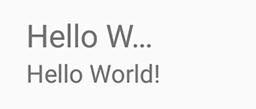

ShrinkTextView
===

[  ](https://bintray.com/star-zero/maven/shrink-textview/_latestVersion)

ShrinkTextView is shrink to fit the view width if the text width exceeds width of view.



## Usage

Add ShrinkTextView to layout file.

```xml
<com.star_zero.shrinktextview.ShrinkTextView
    android:id="@+id/test_no_shrink"
    android:layout_width="200dp"
    android:layout_height="wrap_content"
    android:singleLine="true"
    android:text="Hello World!"
    android:textSize="12sp"
    app:shrink_min_size="8sp" />
```

`shrink_min_size` is setting minimum size of shrinking. It is optional, defualt value is `10sp`.

## Download

Add dependencies to Gradle.

```groovy
compile 'com.star_zero:shrink-textview:1.0.0'
```

## License

```
Copyright 2016 Kenji Abe

Licensed under the Apache License, Version 2.0 (the "License");
you may not use this file except in compliance with the License.
You may obtain a copy of the License at

   http://www.apache.org/licenses/LICENSE-2.0

Unless required by applicable law or agreed to in writing, software
distributed under the License is distributed on an "AS IS" BASIS,
WITHOUT WARRANTIES OR CONDITIONS OF ANY KIND, either express or implied.
See the License for the specific language governing permissions and
limitations under the License.
```